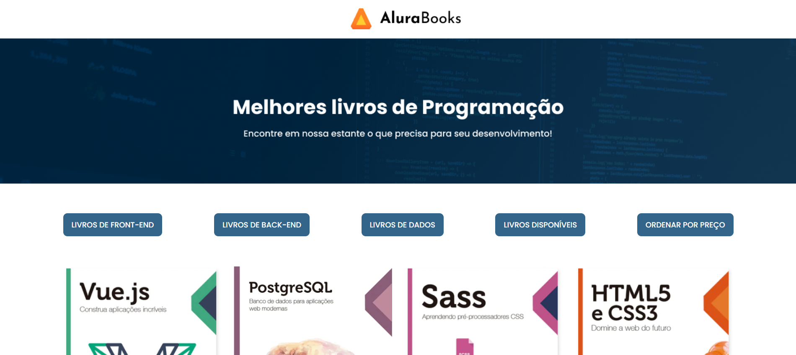

# 📚 AluraBooks

Projeto desenvolvido durante um curso da Alura com o objetivo de praticar JavaScript, manipulação do DOM e consumo de API.

## 📖 Sobre o projeto

O projeto simula uma loja de livros da Alura, onde é possível visualizar e interagir com uma lista de livros carregada dinamicamente através de uma API.

O HTML e CSS foram disponibilizados pelo curso, enquanto toda a lógica em JavaScript foi desenvolvida durante o projeto.

## 🚀 Funcionalidades

- 📚 Consumo de API para listagem de livros
- 🖥️ Renderização dinâmica dos livros na tela
- 💰 Aplicação de desconto nos preços
- 🔎 Sistema de filtragem de livros por categoria

## 🖼️ Preview do projeto

## 🚀 Preview

## 🚀 Deploy

Acesse o projeto online:

https://alurabooks-javascript-beta.vercel.app/

🚧 Projeto em desenvolvimento. Algumas funcionalidades ainda estão sendo implementadas.

## 🛠 Tecnologias utilizadas

- HTML5

- CSS3

- JavaScript (ES6+)

- Fetch API

- Manipulação do DOM

## 📈 Melhorias futuras

- Melhorar responsividade para diferentes tamanhos de tela
- Melhorar acessibilidade da aplicação (ARIA e navegação por teclado)
- Implementar persistência de dados
- Integrar com uma API real de livros
- Adicionar testes automatizados
- Implementar renderização dinâmica dos livros via JavaScript

## 📚 Aprendizados

Durante o desenvolvimento deste projeto foram praticados:

Consumo de API utilizando Fetch

Manipulação do DOM com JavaScript

Uso de métodos de array como map(), filter() e sort()

Organização de código em funções reutilizáveis

Boas práticas de desenvolvimento front-end

## 👨‍💻 Autor

Desenvolvido por **Eduardo Sousa Horvate**